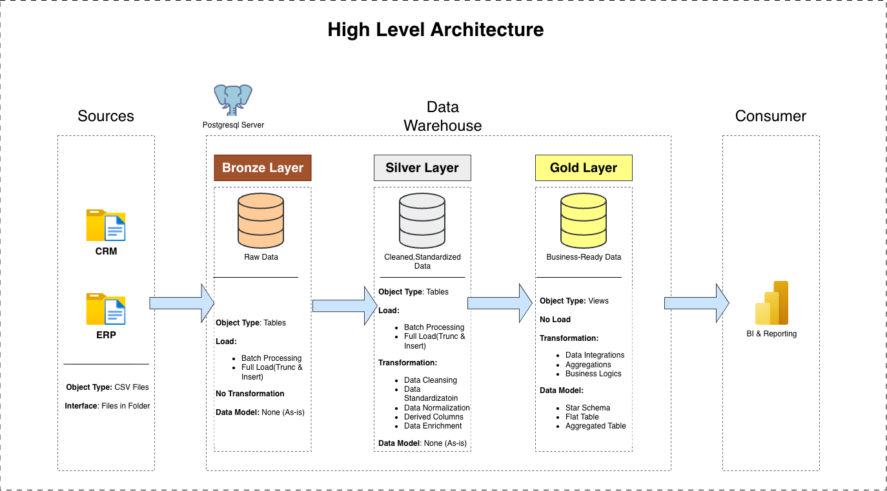
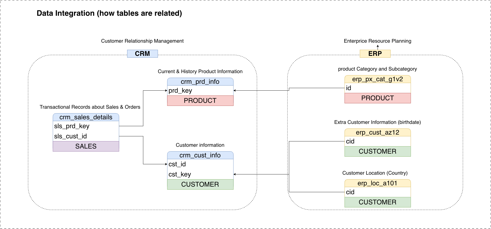
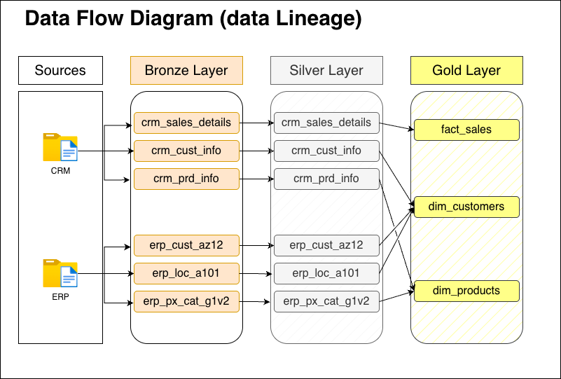
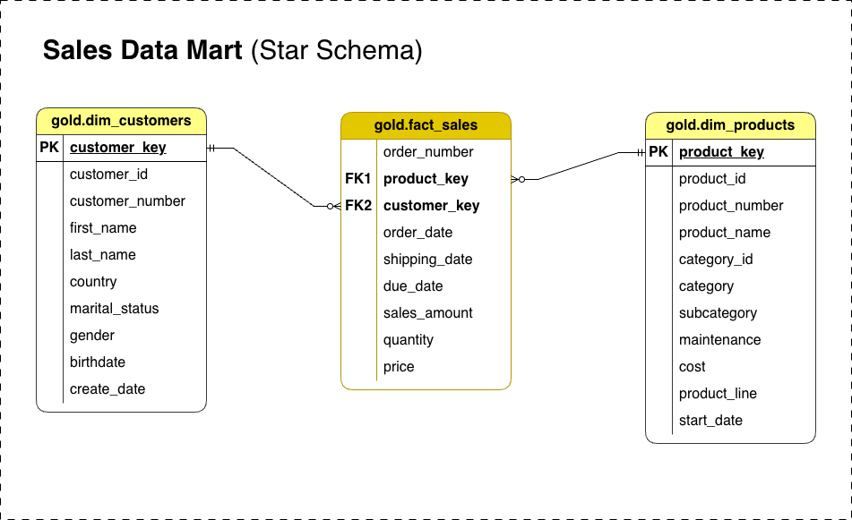

# SQL Data Warehouse Project

This project implements a full **SQL Data Warehouse** using **PostgreSQL** as the database engine and **pgAdmin** for administration, schema design, and transformation execution.  
The warehouse is built following the **Medallion Architecture (Bronze → Silver → Gold)** and integrates CRM + ERP data to produce a clean, analytics-ready **Sales Data Mart**.

The objective of this repository is to demonstrate a realistic, production-style warehouse flow using only SQL and PostgreSQL, with all lineage and modeling clearly documented through diagrams.

---

## Medallion Architecture Overview



### Bronze Layer – Raw Zone
- Direct ingestion from CRM & ERP.
- Stored exactly as received.
- No transformations; designed for history and traceability.

### Silver Layer – Standardized Zone
- Cleansed and standardized data.
- Type corrections, formatting, enrichment.
- Integrated, trusted dataset for downstream modeling.

### Gold Layer – Business Zone
- Business-ready fact and dimension models.
- Optimized for BI, analytics, and reporting.
- Follows star-schema design principles.

---

## Data Integration Model (CRM + ERP)



This model shows how CRM and ERP entities map into unified warehouse structures and how keys flow across systems.

---

## Data Lineage (Bronze → Silver → Gold)



A complete visual lineage showing how each source table flows through all three Medallion layers before becoming a business model.

---

## Sales Data Mart (Star Schema)



The Gold Layer exposes a star schema with a central fact table linked to conformed customer and product dimensions—directly used for BI and reporting.

---

## 📁 Repository Structure
```
SQL-DATA-WAREHOUSE-PROJECT/
│
├── datasets/                           # Source datasets (CRM + ERP)
│   ├── source_crm/
│   │   ├── cust_info.csv
│   │   ├── prd_info.csv
│   │   └── sales_details.csv
│   │
│   └── source_erp/
│       ├── CUST_AZ12.csv
│       ├── LOC_A101.csv
│       └── PX_CAT_G1V2.csv
│
├── docs/                               # Project documentation and diagrams
│   ├── data_catalog.md
│   ├── data_flow_diagram.png
│   ├── data_model_diagram.png
│   ├── data_warehouse_diagram.png
│   └── integration_model_diagram.png
│
├── scripts/                            # SQL scripts for ETL and transformations
│   ├── bronze/                         # Bronze layer SQL scripts
│   ├── silver/                         # Silver layer SQL scripts
│   └── gold/                           # Gold layer fact & dimension SQL scripts
│
├── tests/                              # Data quality checks
│   ├── quality_checks_gold.sql
│   └── quality_checks_silver.sql
│
├── init_database.sql                   # Base schema setup (PostgreSQL)
│
├── README.md                           # Project overview
├── LICENSE                             # License details
└── .gitignore                          # Git ignore rules

```
---

##  Highlights

- Built entirely using **PostgreSQL + pgAdmin**
- Clean Medallion architecture implementation
- End-to-end lineage from sources → Bronze → Silver → Gold
- Realistic CRM/ERP warehouse modeling  
- Clear diagram-based documentation  

## 🛡️ License

This project is licensed under the MIT License. You are free to use, modify, and share this project with proper attribution.

## 🌟 About Me

Hi there! I'm **Vecham Gautham**, an **aspiring Data Engineer** passionate about building data platforms, warehouses, and automated pipelines.

For questions or feedback, feel free to reach out at: **vechamgautham2003@gmail.com**

